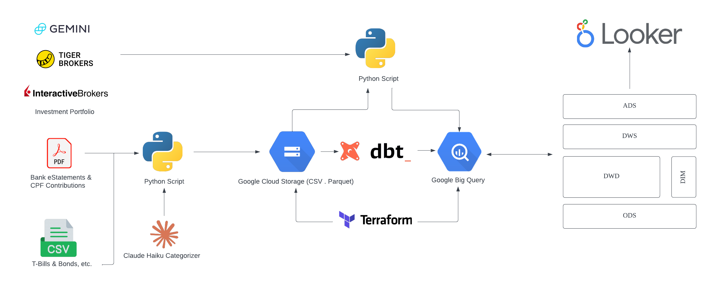

# Clairvoyance

A personal finance data pipeline that automatically ingests bank statements, investment positions, CPF balances, and Singapore Savings Bonds into BigQuery — then transforms them into a net worth and spending dashboard via dbt and Grafana.

## Architecture



## Pipelines

| Pipeline | Trigger | What it does |
|---|---|---|
| `bank` | PDF dropped in GCS `inbox/` via Eventarc | Parses UOB savings & credit card PDFs, categorises transactions with Claude Haiku, loads to BQ |
| `investment` | Cloud Scheduler — daily 6am SGT | Fetches positions from Tiger Brokers, IBKR Flex, and Gemini; converts to SGD; loads to BQ |
| `cpf` | PDF dropped in GCS bucket root via Eventarc | Parses CPF Account Balances PDF (OA, SA, MA), loads to BQ |
| `ssb` | Cloud Scheduler — 1st of month 9am SGT | Reads `ssb_holdings.csv` from GCS `config/`, loads snapshot to BQ |
| `dbt` | Cloud Scheduler — daily 6:30am SGT | Runs dbt transformations across dwd → dws → ads layers |

## Data Layers (BigQuery)

```
ods   Raw ingested data (one table per source)
 │
dwd   Cleaned and typed (dedup, category overrides, date parsing)
 │
dws   Aggregated (net worth history, monthly spend, savings rate)
 │
ads   Dashboard-ready (pivoted net worth, MoM deltas, spend by category)
```

### Key tables

| Table | Description |
|---|---|
| `ods.ods_bank_transactions_df` | Raw bank transactions with LLM-assigned categories |
| `ods.ods_investment_positions_df` | Daily investment snapshots in native currency + SGD |
| `ods.ods_account_balances_df` | Monthly UOB savings account closing balances |
| `ods.ods_cpf_balances_df` | CPF OA / SA / MA balances per statement |
| `ods.ods_ssb_holdings_df` | SSB holdings snapshot per pipeline run |
| `dwd.dwd_bank_transactions_df` | Cleaned transactions (transfers, income, reimbursements excluded) |
| `dwd.dwd_investment_positions_df` | Cleaned positions with SGD normalisation |
| `dws.dws_net_worth_history_df` | Monthly net worth by asset class and source |
| `dws.dws_monthly_spend_df` | Monthly spend aggregated by category |
| `dws.dws_monthly_savings_rate_df` | Monthly income, spend, and savings rate |
| `ads.ads_net_worth_dashboard_df` | Monthly pivoted: stocks, crypto, cash, SSB, CPF — with carry-forward |
| `ads.ads_net_worth_daily_df` | Daily pivoted net worth with day-over-day change |
| `ads.ads_monthly_spend_dashboard_df` | Spend by category with MoM delta and % change |

## Transaction Categories

The bank pipeline uses Claude Haiku to categorise transactions. Deterministic overrides in the dwd layer handle edge cases:

| Category | Notes |
|---|---|
| Groceries / Dining / Transport / Shopping / Entertainment / Utilities / Healthcare / Travel / Education / Insurance | Shown in spend dashboard |
| Investment | Transfers to brokers and crypto exchanges |
| Transfer | Credit card bill payments, inter-account transfers |
| Income | Salary, government credits, cashback — excluded from spend |
| Reimbursement | Incoming PayNow from named individuals — excluded from spend |

## Project Structure

```
ingestion/
  bank/
    pdf_parser.py      PDF → RawTransaction dataclass
    categoriser.py     Claude Haiku batch categorisation
    pipeline.py        Orchestrates parse → categorise → GCS → BQ
    service.py         Flask app — Eventarc target for PDF uploads
  investment/
    pipeline.py        Fetches Tiger, IBKR, Gemini positions
    tiger.py / ibkr.py / gemini.py
    fx.py              FX rates → SGD conversion
  cpf/
    pdf_parser.py      Extracts OA / SA / MA from CPF PDF
    pipeline.py
  ssb/
    pipeline.py        Reads ssb_holdings.csv from GCS

dbt/clairvoyance/
  models/
    dwd/               Clean layer
    dws/               Aggregation layer
    ads/               Dashboard layer
  profiles.yml         Uses GCP_PROJECT_ID env var (ADC auth)

terraform/
  main.tf              All GCP infrastructure
  variables.tf
  terraform.tfvars     ← gitignored, contains secrets

assets/
  grafana-dashboard.json   Grafana dashboard definition (import to Grafana Cloud)

Dockerfile             Single image, PIPELINE env var routes entrypoint
entrypoint.sh          Routes: bank | bank-service | investment | cpf | ssb | dbt
```

## Infrastructure (Terraform)

All GCP resources are managed in `terraform/`:

- **Artifact Registry** — Docker image repository
- **GCS buckets** — bank, CPF, and investments storage
- **BigQuery datasets** — ods, dwd, dws, ads
- **Secret Manager** — API keys for Anthropic, Tiger, IBKR, Gemini
- **Cloud Run Jobs** — bank, investment, cpf, ssb, dbt
- **Cloud Run Service** — bank-service (Eventarc target)
- **Eventarc triggers** — fires on GCS `object.finalized` in bank bucket (`inbox/`) and CPF bucket (root)
- **Cloud Scheduler** — investment (daily), dbt (daily), ssb (monthly)
- **Service Account** — `clairvoyance-pipeline` with least-privilege IAM roles

## Dashboard

Built in **Grafana Cloud** (free tier), connected directly to BigQuery via the BigQuery plugin.

The dashboard definition lives at `assets/grafana-dashboard.json` — import it via Grafana → Dashboards → Import.

Key data sources:
- `ads.ads_net_worth_dashboard_df` — KPI cards and net worth time series
- `ads.ads_net_worth_daily_df` — daily net worth with day-over-day change
- `ads.ads_monthly_spend_dashboard_df` — spending by category bar chart
- `dwd.dwd_bank_transactions_df` — recent transactions table

## Setup

### Prerequisites

- GCP project with billing enabled
- `gcloud` CLI authenticated
- `terraform` >= 1.5.7
- Docker with buildx
- Python 3.11+

### 1. Configure secrets

```bash
cp .env.example .env
# Fill in your API keys

cp terraform/terraform.tfvars.example terraform/terraform.tfvars
# Fill in project_id, secrets, and bucket names
```

### 2. Apply infrastructure

```bash
cd terraform
terraform init
terraform apply
```

### 3. Build and push the Docker image

```bash
gcloud auth configure-docker asia-southeast1-docker.pkg.dev

docker build --platform linux/amd64 \
  -t asia-southeast1-docker.pkg.dev/<PROJECT_ID>/clairvoyance/pipeline:latest \
  --push .
```

### 4. Update pipeline_image and re-apply

```hcl
# terraform/terraform.tfvars
pipeline_image = "asia-southeast1-docker.pkg.dev/<PROJECT_ID>/clairvoyance/pipeline:latest"
```

```bash
terraform apply
```

### 5. Set up Grafana

1. Sign up at [grafana.com](https://grafana.com) (free tier)
2. Install the **Google BigQuery** plugin (Connections → Add new connection)
3. Add a BigQuery data source using a GCP service account key with `roles/bigquery.dataViewer` and `roles/bigquery.jobUser`
4. Import `assets/grafana-dashboard.json` via Dashboards → Import

## Local Development

```bash
pip install -e ".[dev]"

# Run bank pipeline locally
python -m ingestion.bank.pipeline --pdf path/to/statement.pdf

# Run investment pipeline locally
python -m ingestion.investment.pipeline

# Run tests
pytest
```

